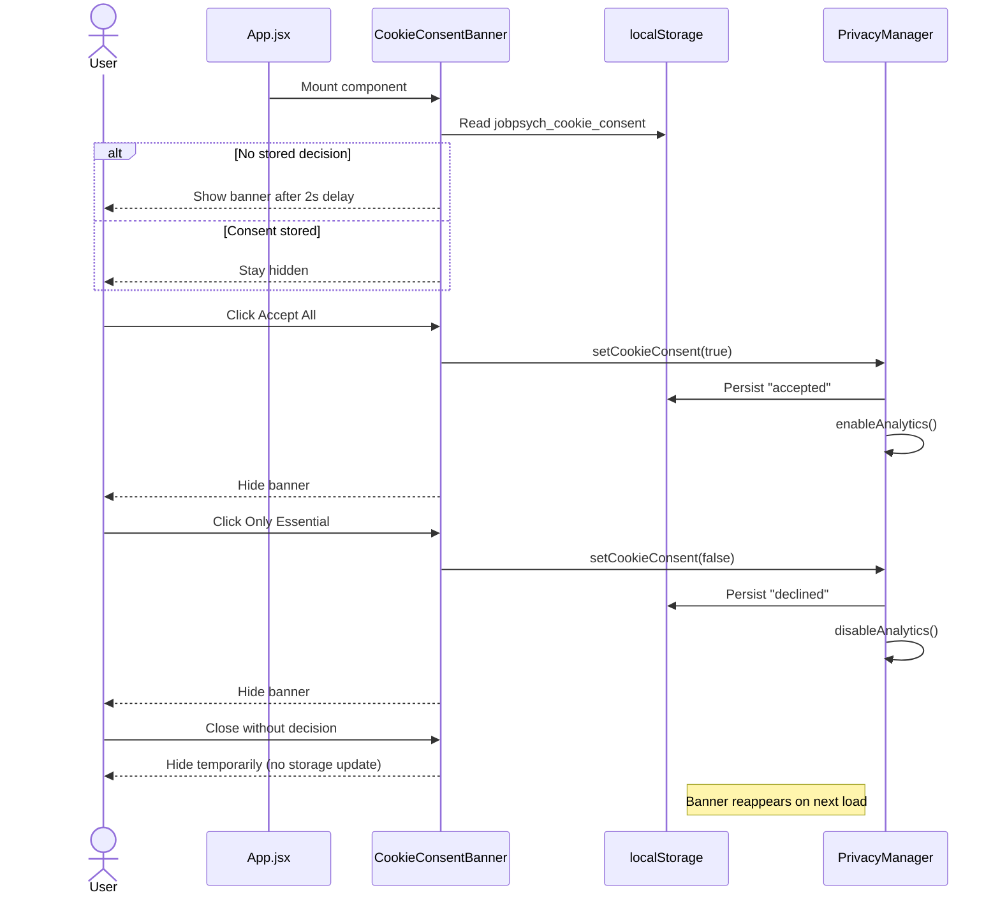

# Cookie Consent Flow

The JobPsych frontend stores consent preferences in `localStorage` rather than browser cookies. This document explains the full lifecycle and participating modules.

## Components & Utilities

- `src/components/privacy/CookieConsentBanner.jsx` – UI banner that collects consent and reveals cookie categories.
- `src/utils/securityAudit.js` → `PrivacyManager` – persistence/analytics toggles; exposes `hasCookieConsent()` and `setCookieConsent(accepted)`.
- `src/App.jsx` – mounts the consent banner so it appears on every route.

## Consent Lifecycle

## Detailed Workflow

1. **Application boot** – `App.jsx` renders `CookieConsentBanner`.
2. **Initial check** – On mount, the banner checks two flags:
   - `PrivacyManager.hasCookieConsent()` returns `true` if `localStorage.jobpsych_cookie_consent === "accepted"`.
   - Direct lookup for `"declined"` to avoid reopening when essentials-only was chosen.
3. **Banner visibility**
   - If neither flag exists, a `setTimeout` opens the banner after 2000 ms.
   - Any existing decision keeps the banner hidden.
4. **Accept All**
   - Calls `PrivacyManager.setCookieConsent(true)` → stores `"accepted"`, triggers `enableAnalytics()`, then hides banner.
5. **Only Essential**
   - Calls `PrivacyManager.setCookieConsent(false)` → stores `"declined"`, triggers `disableAnalytics()`, then hides banner.
6. **Customize**
   - Toggles informational panel describing the three cookie categories (Essential, Analytics, Marketing). No granular storage yet.
7. **Close (X)**
   - Sets local state to hide but **does not persist** a decision. Banner will reappear on next load until Accept/Essential is chosen.

## Persistence & Retrieval

- **Storage key**: `jobpsych_cookie_consent`
- **Values**:
  - `"accepted"` – Full consent, analytics enabled.
  - `"declined"` – Essentials only, analytics disabled.
- No direct use of `document.cookie`; everything hinges on `localStorage`.

## Analytics Hooks

`PrivacyManager.enableAnalytics()` / `disableAnalytics()` currently log warnings in development mode (`import.meta.env.DEV`). In production, replace these stubs with actual analytics initialization/teardown so consent drives tracking behavior.

## Extension Ideas

- Store category-level preferences instead of a single flag if granular control is needed.
- Expose a settings panel so users can revisit their consent choice.
- Wire `enableAnalytics` / `disableAnalytics` into concrete analytics loaders (e.g., Google Analytics, Segment).
